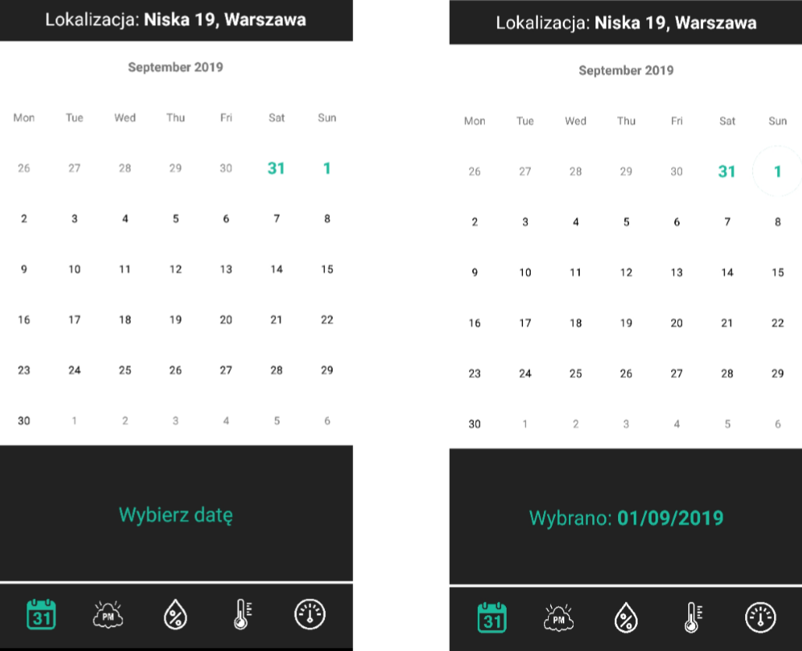

# android-dust-sensor-project
Mobile application for Android, which is a part of project [Dust Sensor Project](https://github.com/TomWaks/dust-sensor-project)

My application is composed of 4 activities: 
* [MapsActivity](#maps-activity)
* [ConfigActivity](#config-activity)
* [ChartsActivity](#charts-activity)

## MapsActivity 
This activity is responsible for presentation all locations on map where from data.
This activity contains information about status of device and its location or last time when the sensor was available.
<kbd></kbd>

The user can select location and go to presention all data for this location.
Other actions for user:
- go to [ConfigActivity](#config-activity)
- refresh current activity

<kbd></kbd>

## ConfigActivity 
This activity is responsible for giving possibilities to changing configuration data:
* time of measurement
* numbers of measurement
* break time between measurement
* radius of accuracy

<kbd></kbd>

## ChartsActivity 
This activity is responsible for presentation data for selected location in [MapsActivity](#maps-activity):
* The user can select date for which data should be shown.

<kbd></kbd>

The user can show charts:
- PM2.5 and PM10

<kbd></kbd>

- air temperature

<kbd></kbd>

- atmospheric pressure

<kbd></kbd>

- relative air humidity

<kbd></kbd>
